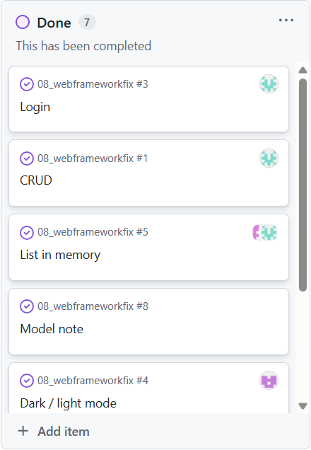
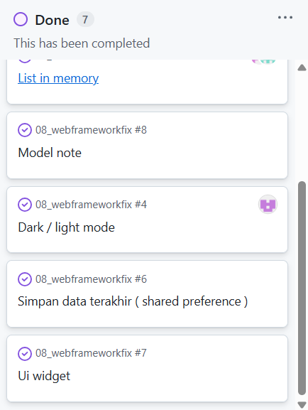

# Simplenote

## Identitas Tim
**Anggota Kelompok:**
- Alifa Nur Azizah - 2310120002
- Tiara Widya - 2310120013
- Marizke Mega Utami - 2310120023

## Tema Aplikasi
**Aplikasi Catatan Sederhana** - Sebuah aplikasi mobile untuk mencatat dan mengelola catatan harian dengan antarmuka yang user-friendly.

## Deskripsi Fitur
Aplikasi Simple Notes memungkinkan pengguna untuk:
- ✨ Membuat catatan baru dengan judul dan konten
- 👀 Melihat daftar semua catatan yang tersimpan
- 🗑️ Menghapus catatan yang tidak diperlukan
- 🎨 Antarmuka yang elegan dengan tema warna earth tone
- ⚡ Animasi smooth untuk pengalaman pengguna yang baik

## Pembagian Tugas
- Alifa Nur Azizah    : Membuat Halaman Login dan Validasi
- Tiara Widya         : CRUD dan List
- Marizke Mega Utami  : Mode Ligh/dark dan sharedpreferences

### To DO 

## Screenshot Aplikasi

### Tampilan login

### Tampilan Tambah Catatan

### Tampilan Mode Light 

### Tampilan Mode Dark 

## Tampilan Edit Catatan 

## Penjelasan Fitur Login 
Pada aplikasi ini, fitur login dibuat dengan menggunakan SharedPreferences. Jadi, ketika pengguna memasukkan username dan password, aplikasi akan menyimpan data tersebut ke dalam penyimpanan lokal perangkat. Yang menarik, aplikasi juga menyimpan status apakah pengguna sudah login atau belum. Hasilnya, ketika aplikasi dibuka kembali, pengguna tidak perlu repot login ulang karena aplikasi langsung mengingat status login sebelumnya dan langsung masuk ke halaman utama. Ini membuat pengalaman pengguna terasa lebih cepat dan nyaman tanpa proses autentikasi yang berulang-ulang.

## Penjelasan Fitur Mode Light/Dark 
Aplikasi juga menyediakan fitur untuk mengganti tampilan antara mode terang dan mode gelap. Pengguna cukup menekan ikon matahari atau bulan di bagian atas aplikasi untuk berpindah mode. Setelah mode dipilih, aplikasi menyimpan pilihan tersebut menggunakan SharedPreferences. Jadi, meskipun pengguna menutup atau membuka kembali aplikasi, tampilan akan tetap mengikuti mode yang terakhir digunakan. Fitur ini membuat aplikasi terasa lebih personal, karena pengguna bebas memilih tampilan yang paling nyaman untuk kondisi pencahayaan mereka.

## Penjelasan Implementasi SQLite & SharedPreferences
Aplikasi ini memakai dua jenis penyimpanan yang berbeda. Untuk data catatan yang jumlahnya bisa banyak dan isinya panjang-panjangmmenggunakan SQLite sebagai database utama. Di sini, setiap catatan disimpan lengkap dengan judul, isi, dan waktu dibuat. SQLite memungkinkan catatan disimpan secara permanen dan tetap ada walaupun aplikasi ditutup. Sementara itu, SharedPreferences digunakan hanya untuk data kecil seperti username, status login, tema aplikasi, dan waktu terakhir aplikasi dibuka. Dengan membagi penyimpanan seperti ini, aplikasi tetap ringan tapi tetap bisa menyimpan data penting secara permanen.

## Penjelasan Cara Aplikasi Menyimpan Data 
Secara keseluruhan, aplikasi ini menyimpan data dengan sangat efisien. Catatan yang dibuat pengguna disimpan ke dalam database SQLite sehingga kapan pun aplikasi dibuka, catatan tetap tersedia. Sementara itu, hal-hal seperti tema aplikasi, login terakhir, dan preferensi pengguna disimpan menggunakan SharedPreferences. Artinya, aplikasi mengingat pengaturan terakhir pengguna dan menggunakannya kembali secara otomatis. Dengan kombinasi dua metode penyimpanan ini, aplikasi terasa responsif, data tidak mudah hilang, dan pengalaman pengguna menjadi lebih nyaman.
